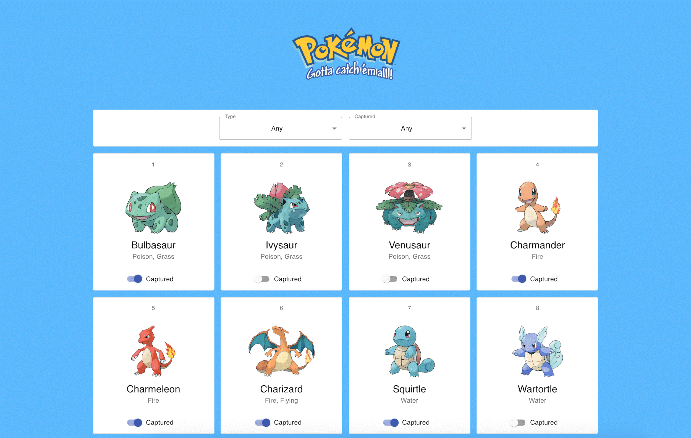

# React assignment

Using `npm create vite@latest my-app -- --template react-ts` generate a new react app written in typescript and using the `./assets/og-pokemon.json` dataset implement the application in the image below:

After generating the app, locate the `/public` directory and create an `assets` directory there. Place `og-pokemon.json` in that directory. Now in the react app you can use `fetch('/assets/og-pokemon.json')` to load the data.

Store the "captured" pokemon data in local storage and load it back when restarting the browser.

Dos
  - Do use [`smart/dumb` components](https://www.jetbrains.com/webstorm/guide/tutorials/react_typescript_tdd/presentation_components/)
  - Do use `FC`s instead of `class` components
  - Do try to create reusable and flexible components when possible
  - Do try to have a file structure that reflects the hierarchy of usage (parent, children, sibling relationships)
  - Keep reusable components in a separate `components` directory

Dont's
  - Don't use any external libraries
  - Don't define more than one component per file
  - Don't use ambiguous variable and function names
  - Avoid using `default` exports

## Directions
- Store all your personal assignments in a directory using the following naming convention: `<firstname>-<lastname>`.
- Create a new directory called `react-assignment` in the previously created directory and place your assignment related files there.
- Create a new branch from `main` called `react-<your-name>`.
- When the work is done push it and open a PR (pull-request)
